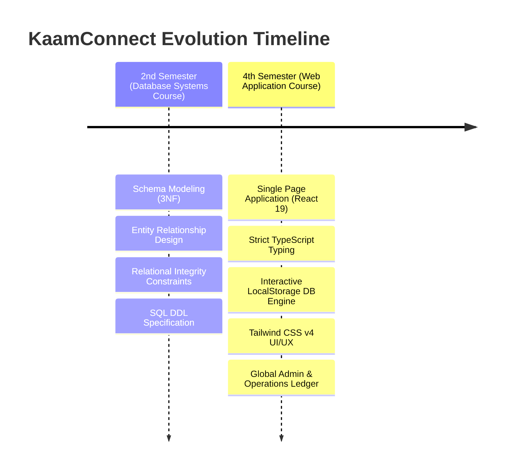
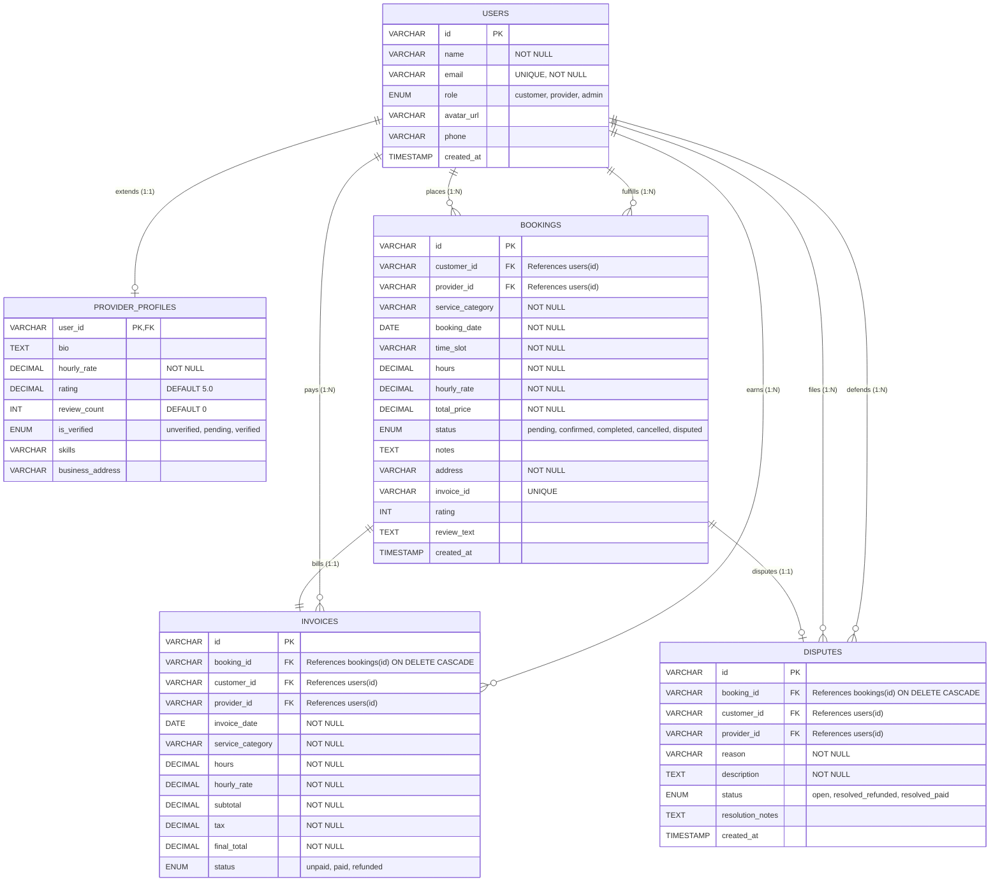

# 🛠️ KaamConnect: On-Demand Home Services Marketplace

[](https://github.com/)
[](https://react.dev/)
[](https://www.typescriptlang.org/)
[](https://tailwindcss.com/)
[](https://www.mysql.com/)

**KaamConnect** is a premium, production-grade on-demand home services marketplace linking customers, background-checked local professionals, and platform administrators. Built on a strict 3rd Normal Form (3NF) relational database foundation, the system supports secure escrow invoicing, conflict-free slot scheduling, user review arbitration, and role-based administrative workflows.

---

## 🎓 Academic Development History

KaamConnect represents the culmination of academic learning and evolution across two semesters of my Computer Science degree. It bridges the gap between database theory and modern frontend software engineering.



### 1. Database Systems Course (2nd Semester)
*   **Focus**: Relational database architecture, relational algebra, entity-relationship modeling (ERD), normalization (1NF through 3NF), and strict data integrity constraints.
*   **Key Contribution**: Modeled the platform's database structure using Chen's notation, generating a fully normalized **MySQL 8.0 DDL**.
*   **Design Highlights**:
    *   Designed a 1:1 relationship between `users` and `provider_profiles` to isolate professional metrics from core credentials.
    *   Engineered a composite unique key constraint `uq_schedule_slot (provider_id, booking_date, time_slot)` at the database layer to mathematically guarantee that no provider can receive duplicate bookings in the same hour block.
    *   Designed cascading reference constraints (`ON DELETE CASCADE`) for child entities like `invoices` and `disputes` to enforce strict relational referential integrity.

### 2. Web Application Development Course (4th Semester)
*   **Focus**: Modern component-based web interfaces, reactive state cycles, type-safe client-server contracts, and responsive premium design.
*   **Key Contribution**: Developed the complete web application frontend using **React 19**, **TypeScript**, and **Tailwind CSS v4**.
*   **Engineering Highlights**:
    *   Virtualised the relational database schema inside the browser using a custom **LocalStorage Relational Adapter** that reads, joins, and maintains relational integrity across tables client-side.
    *   Built a custom **In-Browser MySQL Schema Inspector** to visualize the database tables and current live rows, exposing DDL definitions and demonstrating relational join behaviors to reviewers.
    *   Implemented proper role-based authentication screens (Customer, Provider, Admin) with passwordless secure simulation and one-click quick-logins.
    *   Expanded service categories to 11 options, including a dedicated **Chauffeur & Driver** system.

---

## 📐 Relational Database Schema Design (3NF)

Below is the Entity-Relationship Diagram (ERD) designed during the **2nd Semester Database Course** and fully simulated in the **4th Semester Web Course**.



<details>
<summary>🔑 Click to view raw MySQL DDL Code</summary>

```sql
-- RDBMS: MySQL 8.0+ (Normalized Structure)
CREATE DATABASE IF NOT EXISTS home_services_db;
USE home_services_db;

-- 1. Users Table
CREATE TABLE users (
    id VARCHAR(50) PRIMARY KEY,
    name VARCHAR(100) NOT NULL,
    email VARCHAR(100) UNIQUE NOT NULL,
    role ENUM('customer', 'provider', 'admin') NOT NULL,
    avatar_url VARCHAR(255),
    phone VARCHAR(30),
    created_at TIMESTAMP DEFAULT CURRENT_TIMESTAMP
);

-- 2. Providers Profiles (1:1 with Users role='provider')
CREATE TABLE provider_profiles (
    user_id VARCHAR(50) PRIMARY KEY,
    bio TEXT,
    hourly_rate DECIMAL(10, 2) NOT NULL,
    rating DECIMAL(3, 2) DEFAULT 5.0,
    review_count INT DEFAULT 0,
    is_verified ENUM('unverified', 'pending', 'verified') DEFAULT 'unverified',
    skills VARCHAR(512),
    business_address VARCHAR(255),
    FOREIGN KEY (user_id) REFERENCES users(id) ON DELETE CASCADE
);

-- 3. Bookings Table
CREATE TABLE bookings (
    id VARCHAR(50) PRIMARY KEY,
    customer_id VARCHAR(50) NOT NULL,
    provider_id VARCHAR(50) NOT NULL,
    service_category VARCHAR(50) NOT NULL,
    booking_date DATE NOT NULL,
    time_slot VARCHAR(10) NOT NULL,
    hours DECIMAL(4, 2) NOT NULL,
    hourly_rate DECIMAL(10, 2) NOT NULL,
    total_price DECIMAL(10, 2) NOT NULL,
    status ENUM('pending', 'confirmed', 'completed', 'cancelled', 'disputed') DEFAULT 'pending',
    notes TEXT,
    address VARCHAR(255) NOT NULL,
    invoice_id VARCHAR(50) UNIQUE,
    rating INT,
    review_text TEXT,
    created_at TIMESTAMP DEFAULT CURRENT_TIMESTAMP,
    FOREIGN KEY (customer_id) REFERENCES users(id),
    FOREIGN KEY (provider_id) REFERENCES users(id),
    UNIQUE KEY uq_schedule_slot (provider_id, booking_date, time_slot)
);

-- 4. Invoices Table
CREATE TABLE invoices (
    id VARCHAR(50) PRIMARY KEY,
    booking_id VARCHAR(50) NOT NULL,
    customer_id VARCHAR(50) NOT NULL,
    provider_id VARCHAR(50) NOT NULL,
    invoice_date DATE NOT NULL,
    service_category VARCHAR(50) NOT NULL,
    hours DECIMAL(4, 2) NOT NULL,
    hourly_rate DECIMAL(10, 2) NOT NULL,
    subtotal DECIMAL(10, 2) NOT NULL,
    tax DECIMAL(10, 2) NOT NULL,
    final_total DECIMAL(10, 2) NOT NULL,
    status ENUM('unpaid', 'paid', 'refunded') DEFAULT 'unpaid',
    FOREIGN KEY (booking_id) REFERENCES bookings(id) ON DELETE CASCADE,
    FOREIGN KEY (customer_id) REFERENCES users(id),
    FOREIGN KEY (provider_id) REFERENCES users(id)
);

-- 5. Disputes Table
CREATE TABLE disputes (
    id VARCHAR(50) PRIMARY KEY,
    booking_id VARCHAR(50) NOT NULL,
    customer_id VARCHAR(50) NOT NULL,
    provider_id VARCHAR(50) NOT NULL,
    reason VARCHAR(150) NOT NULL,
    description TEXT NOT NULL,
    status ENUM('open', 'resolved_refunded', 'resolved_paid') DEFAULT 'open',
    resolution_notes TEXT,
    created_at TIMESTAMP DEFAULT CURRENT_TIMESTAMP,
    FOREIGN KEY (booking_id) REFERENCES bookings(id) ON DELETE CASCADE,
    FOREIGN KEY (customer_id) REFERENCES users(id),
    FOREIGN KEY (provider_id) REFERENCES users(id)
);
```
</details>

---

## ⚡ Core Application Workflows & Features

### 👤 Role-Based Portals & Quick Demo Accounts
To simplify academic evaluation, the portal includes pre-configured single-click logins:
*   **Customer (Sarah Johnson)**: Can browse 11 categories of services, review provider profiles, check ratings/reviews, schedule hourly slots, view custom itemized invoices, file service disputes, rate providers, and delete historical bookings.
*   **Service Provider (Alex Rivera - Driver)**: Can accept or decline incoming customer requests, view scheduled calendars, complete jobs, and request payment payouts.
*   **Platform Administrator (Chief Admin)**: Can manage dispute resolutions (fully refunding customers or releasing payments to providers), approve/suspend pending provider profiles, and browse the **Global Operations & Bookings Ledger** (with administrative deletion permissions).

### 🚗 Expanded 11 Service Categories
Includes full search capability, filtering, and customized provider lists for:
1.  Plumbing
2.  Electrical Work
3.  House Cleaning
4.  Gardening
5.  Smart Home Setup
6.  **Chauffeur & Driver** (Dedicated transportation services)
7.  Pest Control
8.  Appliance Repair
9.  Handyman Services
10. AC & HVAC Maintenance
11. Moving & Packing

### 💳 Escrow Financial System & Calculations
All bookings utilize an itemized invoice schema:
*   **Subtotal**: Computed dynamically: $\text{Hours} \times \text{Hourly Rate}$.
*   **Service Tax**: Strict $8\%$ local service tax applied to the subtotal.
*   **Final Total**: $\text{Subtotal} + \text{Tax}$.
*   **Platform Commission**: Tracks a $15\%$ platform brokerage fee internally on all completed bookings, visible on the Admin financial panels.

---

## 🖥️ Live MySQL Inspector Panel
Integrated directly into the interface's footer, this inspector allows students and professors to view database tables in real-time:
*   Shows current mock row counts (e.g. 155 Users, 66 Bookings, 66 Invoices).
*   Enables checking database contents directly inside JSON tables mimicking relational outputs.
*   Includes a **Reset Mock Database** utility, letting developers reset the client storage to default clean seed data populated with 22 customers, 132 providers (12 per category), and 66 bookings.

---

## 🛠️ Technology Stack & Dependencies

*   **Runtime Environment**: Node.js v18+
*   **Client Core**: [React 19](https://react.dev/) (Functional components, custom hooks)
*   **Language**: [TypeScript](https://www.typescriptlang.org/) (Strict type definition for all DB tuples)
*   **Styling**: [Tailwind CSS v4](https://tailwindcss.com/) (Responsive layouts, custom color variables, dark theme cards)
*   **Visual Assets**: [Lucide React Icons](https://lucide.dev/)
*   **Build Bundler**: [Vite](https://vitejs.dev/)

---

## 🚀 Getting Started & Local Setup

Follow these steps to run the project locally on your machine.

### 1. Prerequisites
Make sure you have Node.js and npm installed:
```bash
node -v  # Expected: v18.0.0+
npm -v   # Expected: v9.0.0+
```

### 2. Installation
Clone the repository:
```bash
git clone https://github.com/your-username/kaamconnect.git
cd kaamconnect
```

Install the project dependencies:
```bash
npm install
```

### 3. Run Development Server
Start the local Vite development server:
```bash
npm run dev
```

Open your browser and navigate to:
**[http://localhost:3000](http://localhost:3000)**

---

## 📂 Project Directory Structure

```text
├── src/
│   ├── data/
│   │   └── seedData.ts    # 22 Customers, 132 Providers seed script & SQL DDL
│   ├── types.ts           # DB schema representations in TypeScript interfaces
│   ├── App.tsx            # Main application layouts, dashboards, and CRUD operations
│   ├── main.tsx           # Application entrypoint & DOM injection
│   └── index.css          # Core CSS variables, Tailwind directives, and global styles
├── index.html             # Single Page HTML framework template
├── package.json           # Scripts, metadata, and package dependencies
├── tsconfig.json          # TypeScript compilation configuration
└── vite.config.ts         # Vite server ports and hot module reloading setup
```

---
